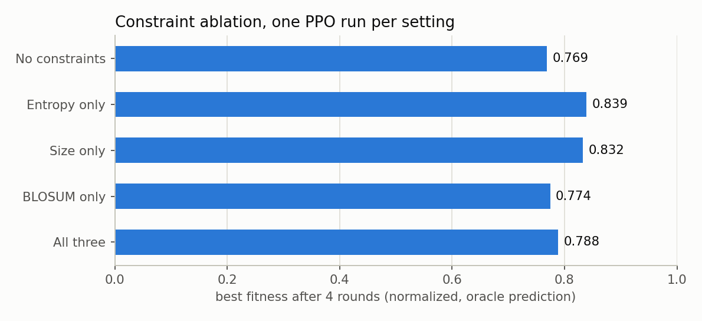
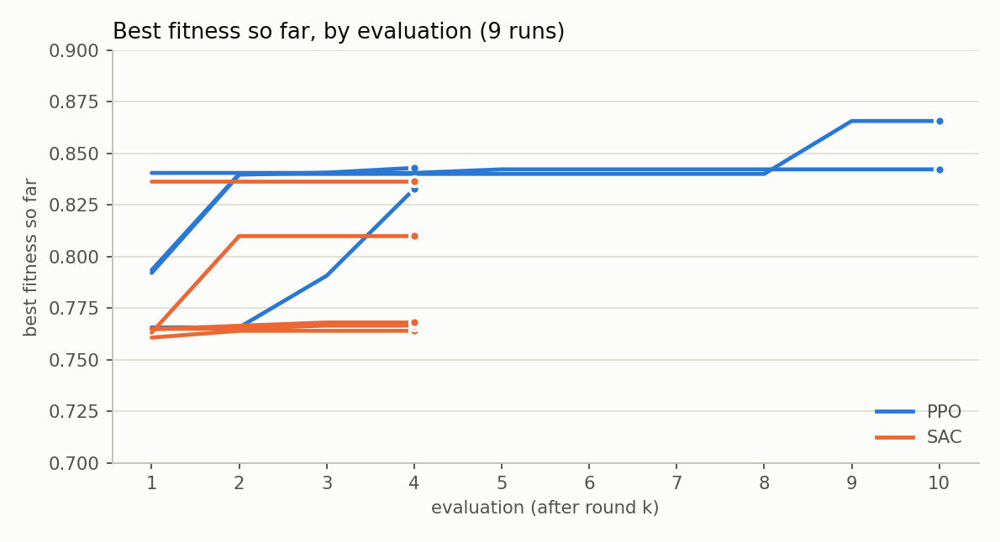
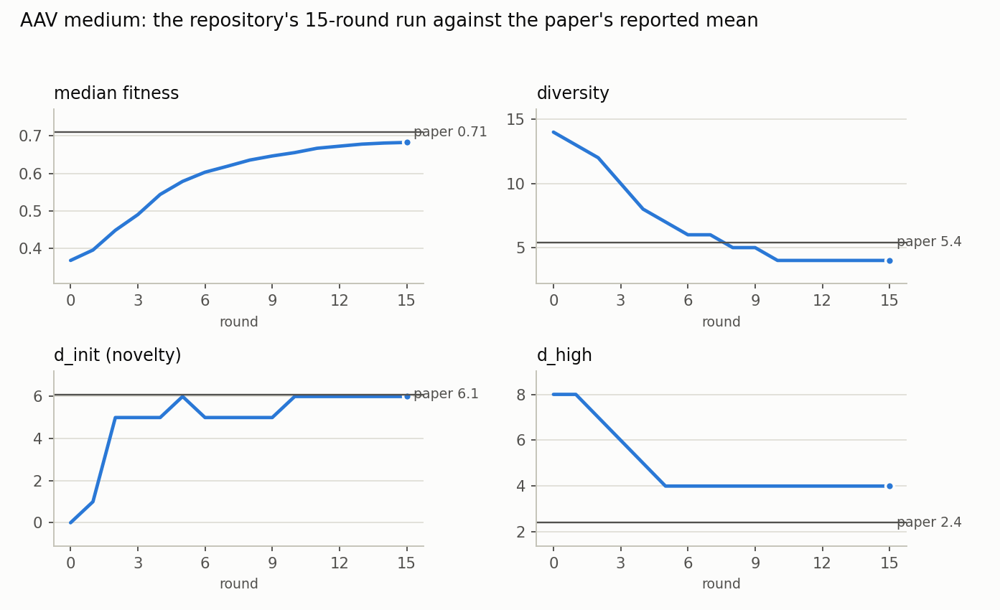

# Experiments

Per-evaluation results of the runs that have a log or result file, with the source of each number. Values come from `results/experiments/log_evaluations.csv` (extracted from the run logs by `analysis/extract_experiments_data.py`), `results/experiments/aav_evaluations.csv`, `results/runs/*/final_research_metrics.json` and `results/baseline_no_rl.json`. "Evaluation k" is the block printed after round k ("EVALUATION METRICS - Round k"). "Global best" is the printed "Global Maximum Fitness (normalized)", an oracle prediction on the 0 to 1 scale. Run settings are given only where a launch script or the file name states them.

## 1. Constraint ablation

Launched by `scripts/run_ablations.sh` (PPO, `--protein DHFR --level medium --use_oracle`, run indices 10 to 14), one run per setting, 4 rounds.

| Setting | Flags | Log | Global best at evaluations 1, 2, 3, 4 | Unique sequences | Oracle calls |
|--|--|--|--|--|--|
| No constraints | `--no_entropy --no_size --no_blosum` | `ablation_none.log` | 0.311 / 0.766 / 0.769 / 0.769 | 336 | 15,360 |
| Entropy only | `--no_size --no_blosum` | `ablation_entropy.log` | 0.311 / 0.764 / 0.791 / 0.839 | 362 | 15,360 |
| Size only | `--no_entropy --no_blosum` | `ablation_size.log` | 0.311 / 0.786 / 0.786 / 0.832 | 368 | 15,360 |
| BLOSUM only | `--no_entropy --no_size` | `ablation_blosum.log` | 0.311 / 0.763 / 0.766 / 0.774 | 346 | 15,360 |
| All three | none | `ablation_all.log` | 0.311 / 0.761 / 0.761 / 0.788 | 361 | 15,360 |

Final global best across the five settings: minimum 0.769, maximum 0.839.

Other logs with constraint settings given by their file names:

| Log | Evaluations | Global best at each evaluation | Oracle calls |
|--|--|--|--|
| `final_run.log` | 4 | 0.311 / 0.770 / 0.770 / 0.770 | 15,360 |
| `dhfr_blosum_run.log` | 4 | 0.311 / 0.767 / 0.767 / 0.767 | 15,360 |

## 2. PPO and SAC runs

| Log | Algorithm | Evaluations | Global best at each evaluation | Oracle calls | Saved metrics (`results/runs`) |
|--|--|--|--|--|--|
| `ppo_baseline_106.log` | PPO | 4 | 0.792 / 0.840 / 0.841 / 0.843 | 15,360 | 0.8430 |
| `ppo_confirmation_107.log` | PPO | 4 | 0.766 / 0.766 / 0.791 / 0.833 | 15,360 | 0.8328 |
| `ppo_production_108.log` | PPO | 2 | 0.762 / 0.762 | 7,680 | none |
| `ppo_dense_113.log` | PPO | 10 | 0.841 / 0.841 / 0.841 / 0.841 / 0.842 / 0.842 / 0.842 / 0.842 / 0.842 / 0.842 | 38,400 | 0.8423 |
| `ppo_unconstrained_111.log` | PPO | 10 | 0.793 / 0.840 / 0.840 / 0.840 / 0.840 / 0.840 / 0.840 / 0.840 / 0.866 / 0.866 | 38,400 | 0.8657 |
| `sac_unconstrained_211.log` | SAC | 4 | 0.763 / 0.810 / 0.810 / 0.810 | 15,360 | 0.8099 |
| `sac_high_delta_210.log` | SAC | 4 | 0.761 / 0.764 / 0.764 / 0.764 | 15,360 | 0.7640 |
| `sac_high_entropy_212.log` | SAC | 4 | 0.765 / 0.765 / 0.767 / 0.767 | 15,360 | 0.7665 |
| `sac_dense_215.log` | SAC | 4 | 0.765 / 0.766 / 0.768 / 0.768 | 15,360 | 0.7680 |
| `sac_cold_start_213_v2.log` | SAC | 4 | 0.836 / 0.836 / 0.836 / 0.836 | 15,360 | 0.8364 |
| `dhfr_training.log` | not stated | 2 | 0.311 / 0.809 | 7,680 | none |

In all nine rows with saved metrics, the final value in the log equals the saved global best to within 0.0001.

## 3. Logs without evaluation blocks

| Log | Evaluation blocks | Last `new_best` printed |
|--|--|--|
| `ppo_cold_start_109.log` | 0 | none |
| `ppo_cold_start_109_v2.log` | 0 | 0.663143 |
| `ppo_unconstrained_110.log` | 0 | 0.715615 |
| `ppo_hard_112.log` | 0 | none |
| `sac_cold_start_213.log` | 0 | none |
| `sac_hard_214.log` | 0 | none |

## 4. Early SAC development logs

| Log | Evaluations | Global best at every evaluation | Last `Total Oracle Calls` printed |
|--|--|--|--|
| `sac_run.log` | 59 | 0.311339 (equal to the initial maximum) | 56 |
| `sac_fresh.log` | 42 | 0.311339 (equal to the initial maximum) | 40 |
| `sac_final_v2.log` | 24 | 0.311339 (equal to the initial maximum) | 23 |
| `sac_isolated.log` | 13 | 0.311339 (equal to the initial maximum) | 13 |

## 5. AAV (the original paper's protein)

Run `AAV_medium_0_13_55_57`: 16 evaluation files (rounds 0 to 15). Evaluator definitions (`metric.py`): fitness = median normalized oracle fitness of the 128 evaluated sequences; diversity = median pairwise distance; novelty = median distance to the nearest initial-dataset sequence (d_init); high = median distance to the nearest of the top-10% sequences (d_high). The flags of this run are not recorded.

| Round | Fitness | Diversity | Novelty (d_init) | d_high |
|--|--|--|--|--|
| 0 | 0.368 | 14 | 0 | 8 |
| 1 | 0.395 | 13 | 1 | 8 |
| 2 | 0.448 | 12 | 5 | 7 |
| 3 | 0.490 | 10 | 5 | 6 |
| 4 | 0.544 | 8 | 5 | 5 |
| 5 | 0.579 | 7 | 6 | 4 |
| 6 | 0.603 | 6 | 5 | 4 |
| 7 | 0.619 | 6 | 5 | 4 |
| 8 | 0.635 | 5 | 5 | 4 |
| 9 | 0.646 | 5 | 5 | 4 |
| 10 | 0.655 | 4 | 6 | 4 |
| 11 | 0.667 | 4 | 6 | 4 |
| 12 | 0.672 | 4 | 6 | 4 |
| 13 | 0.678 | 4 | 6 | 4 |
| 14 | 0.681 | 4 | 6 | 4 |
| 15 | 0.682 | 4 | 6 | 4 |

Compared with the paper (Lee et al., ICML 2024, arXiv:2405.18986, Table 2, LatProtRL on AAV medium, oracle setting; mean of 5 runs, standard deviation in parentheses; 15 rounds, 256 oracle calls per round):

| | Fitness | Diversity | d_init | d_high |
|--|--|--|--|--|
| Paper | 0.71 (0.0) | 5.4 (0.9) | 6.1 (0.2) | 2.4 (0.5) |
| This run, round 15 | 0.68 | 4 | 6 | 4 |

All AAV result folders:

| Run | Evaluation files | Fitness (min to max) | Diversity values | Novelty values | d_high values |
|--|--|--|--|--|--|
| `AAV_hard_0_15_19_50` | 0 | | | | |
| `AAV_medium_0_13_18_23` | 1 | 0.028 to 0.028 | 2 | 0 | 21 |
| `AAV_medium_0_13_55_57` | 16 | 0.368 to 0.682 | 4, 5, 6, 7, 8, 10, 12, 13, 14 | 0, 1, 5, 6 | 4, 5, 6, 7, 8 |
| `AAV_medium_0_15_15_27` | 1 | 0.028 to 0.028 | 2 | 0 | 21 |
| `AAV_medium_0_15_36_02` | 1 | 0.028 to 0.028 | 2 | 0 | 21 |
| `AAV_medium_0_18_00_05` | 8 | -0.000 to -0.000 | 2 | 0 | 21 |
| `AAV_medium_0_18_12_43` | 1 | 0.028 to 0.028 | 2 | 0 | 21 |
| `AAV_medium_0_19_03_38` | 1 | 0.009 to 0.009 | 2 | 0 | 21 |
| `AAV_medium_0_20_00_10` | 0 | | | | |
| `AAV_medium_0_20_05_30` | 0 | | | | |
| `AAV_medium_0_20_15_12` | 1 | 0.007 to 0.007 | 2 | 0 | 21 |
| `AAV_medium_0_22_12_28` | 2 | -0.008 to -0.008 | 2 | 0 | 21 |
| `AAV_medium_0_22_23_21` | 0 | | | | |
| `AAV_medium_0_22_50_14` | 9 | 0.028 to 0.028 | 2 | 0 | 21 |
| `AAV_medium_0_23_55_47` | 7 | 0.028 to 0.028 | 2 | 0 | 21 |

## 6. Search without RL, same oracle (`analysis/baseline_no_rl.py`)

| Method | Best oracle score | Oracle calls |
|--|--|--|
| Score every single mutant, take the best (D1M) | 0.979 | 4,161 |
| Greedy hill-climb, 2 steps | 1.000 (at the normalization ceiling) | 8,303 |
| All pairs among the 20 best-labelled single mutants | 1.000 (at the ceiling) | 190 |
| Random combinations of 1 to 5 single mutants, 15,360 draws | 1.000 (at the ceiling); mean 0.340 | 15,360 |
| Random combinations of 1 to 5 single mutants, 38,400 draws | 1.000 (at the ceiling); mean 0.340 | 38,400 |

For comparison, the best RL run in `results/runs` scores 0.8657 with 38,400 oracle calls. The baselines start from the reference sequence; the RL runs start from a pool of 128 sequences around the 10th percentile of fitness (normalized 0.28 to 0.31).

## 7. Coverage

- 28 run logs read, containing 218 evaluation blocks (`results/experiments/log_summary.csv` lists each log with its MD5).
- 19 DHFR runs have saved final metrics (`results/runs/`); 265 result folders exist on the cluster, the rest partial or empty.
- The 222 offline Weights & Biases runs are not parsed here.
